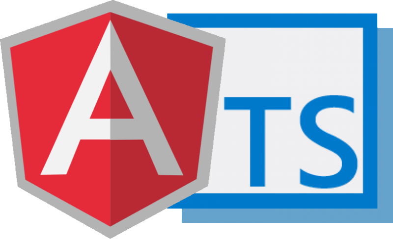

#  Angular Example


---

##  Tabla de contenidos


- [Introduccíon](#Introducción)
- [About](#About )
- [Characteristics](#Características)
- [Instalación](#instalación)
- [Dependencias](#Dependencias)
- [Anexo](#Anexo)
- [Team](#team)


---

 
## Introduction


  -  Desarrollo de una sencilla aplicación usando Angular, con diferentes tipos de funcionalidades.

---
 ## About

  - 🇬🇧 The main goal of this project is to put in practice some coding usign TypeScript.
   This project is being developed by [Jhosef A. Cardich Palma](https://www.linkedin.com/in/jhosef-anderson-cardich-palma-74765788/). 

---
  - 🇪🇸 El objetivo principal de este proyecto es el uso de Angular y TypeScript.   Este proyecto esta siendo desarrollado por [Jhosef A. Cardich Palma](https://www.linkedin.com/in/jhosef-anderson-cardich-palma-74765788/).


 ---


## Instalación

 - El proyecto se iniciara mediante...

> Instalación Angular via homebrew on mac  (consultar en la web para Windows, Linux..)
```
$ brew install 
 ```
- Después de haber installado Angular con npm en el sistema anfitrión
se procedera a situarse la terminal en el directorio raíz del proyecto y ejecutar el siguiente comando
para instalar las dependencias e iniciar el sistema (Este ejecuta un secillo servidor en el puerto 3000).

> Instalación de la aplicación 
```
$ npm start 
 ```

> El sistema nos mostrará el siguiente mensaje por terminal
```
El servidor esta corriendo en el puerto 3000..
 ```
- De esta manera se ejecuta un servidor sencillo que muestra un mensaje por la terminal y además se puede observar en la dirección 'localHost:3000' un mensaje de bienvenida. 
Esta es una las varias sencillas aplicaciones que se han desarrollado en cada una de las carpetas disponibles dentro del sistema. 

---
 

## Características

### Componentes principales


> Para ejecutar las aplicaciones, situarse en la carpeta y ejecutar el siguiente comando..

```
ng serve... 
 ```


- #### component/view-1

Por defecto es la que se ejecuta cuando se instala la aplicacion por primera vez. 
> Para ejecutar el servidor, situarse en la carpeta 'server 'y ejecutar:


````
$ node index.js
````

<r></r1>

- ####  component/view-2
Algunas de las operaciones más basicas de matemáticas, se iran agregando mas..
> Situarse en la carpeta 'maths' y ejecutar

```
node index.js
 ```

Esto nos mostrará el resulado de las cuatro operaciones básicas de matemátias.


----

## Dependencias


- [Angular](https://nodejs.org/dist/)
----
## Team
> Contributors/People

| <a href="https://www.linkedin.com/in/jhosef-anderson-cardich-palma-74765788/" target="_blank">**Jhosef A. Cardich Palma**</a> | 
| :---: |
|  <a href="https://www.linkedin.com/in/jhosef-anderson-cardich-palma-74765788/" target="_blank"></a>   |
|***Full-Stack Software Developer***|
| Linkedin:   <a href="https://www.linkedin.com/in/jhosef-anderson-cardich-palma-74765788/" target="_blank">` Jhosef A. Cardich Palma`</a>| 
| Twitter: <a href="http://twitter.com/jhosefcardich" target="_blank">`@JhosefCardich`</a>| 
|Instagram: <a href="http://instagram.com/arts_hot" target="_blank">`@ARTS-HOT`</a>


---
## Anexo 

### Angular Configuration
We have to install all the dependencies before:
- Node.js


---
Angular CLI allows creating new Angular projects with a basic folder structure and other required features. It also provides utilities to create servers, generate components, build packages, etc.
Skip these steps if you have the latest version of everything and go to the [Creating a Basic Project section](#Initialization)  to create the project
> Updating the Angular Cli: Removing old versions

```
$ npm uninstall -g angular-cli
```

> Updating Angular: Removing old versions
```
npm uninstall -g @angular/cli
```

> Cleaning npm cache 

```
$ npm cache clean --force
```
> Angular Cli: Installing the latest version

```
$ npm install -g @angular/cli@latest
```

### Initialization 

We can create a new project following the next steps: 


> 1. Creating a new project
- We'll be asked for some information about the project. So, in the first, after the execution of the command below, angular CLI will ask us ***"would you like to add Angular Routing?"*** type ***No***. Generating routines automatically could generate errors. We can create the routing later. In the next question just push enter until the process starts to create the files and folders.. 

```
$ ng new
```
> 2. Starting ng serve
- The command bellow compiles all the files of the project and starts a local server. This server reloads all the code and compilation when a change is detected in the code, so the project view will be updated automatically and we'll be able to see the changes in the browser without the need of re-starting the server.

```
$ ng serve
```

### Development 

we can create views for our app. Firstly we have to create components. A component is a piece of html view that will be showed in the browser.
Al the components are located in the directory: ***"src/app/components"*** (It`s a convention to develop an kept the project structure orgnized)    

> Creating a component:
```
$ ng g component components/[name-component]
```
